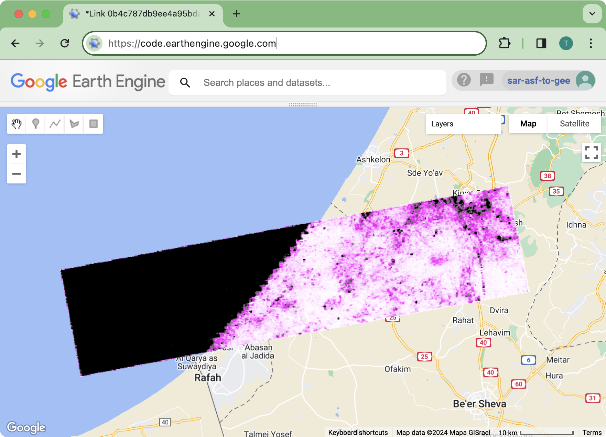

# sar-asf-to-gee

<!-- WARNING: THIS FILE WAS AUTOGENERATED! DO NOT EDIT! -->

# Overview

This package facilitates the transfer of ASF HyP3 processed SAR datasets
to Google Cloud Storage and the creation of Google Earth Engine assets.

 *Screenshot showing
a coherence image produced by ASF HyP3, visualized in the Google Earth
Engine Code Editor.*

# Install

## Prerequisites

1.  A NASA Earthdata account
    - You can register for an Earthdata Login here:
      https://www.earthdata.nasa.gov/eosdis/science-system-description/eosdis-components/earthdata-login
    - Create a `.netfc` file that contains the Earthdata authentication
      credentials. See:
      https://nasa-openscapes.github.io/2021-Cloud-Hackathon/tutorials/04_NASA_Earthdata_Authentication.html
2.  A Google Cloud account
    - Create Google Cloud authentication credentials using the [Google
      Cloud Command Line Interface](https://cloud.google.com/cli) with
      the command: `gcloud auth application-default login`
    - See:
      https://cloud.google.com/sdk/gcloud/reference/auth/application-default/login
3.  A Google Earth Engine account
    - Create Google Earth Engine authentication credentials using the
      [Google Earth Engine Command Lin
      Tool](https://developers.google.com/earth-engine/guides/command_line)
      with the command: `earthengine authenticate`
    - See: https://developers.google.com/earth-engine/guides/auth

## Package Installation

Install directly from the GitHub repo.

``` sh
pip install git+https://github.com/gee-community/sar-asf-to-gee.git
```

# How to use

This package assumes that you have already created datasets using the
[ASF HyP3](https://hyp3-docs.asf.alaska.edu/) processing system using
either the [ASF Data Search
Vertex](https://hyp3-docs.asf.alaska.edu/using/vertex/) web interface or
programmatically using the [HyP3 SDK for
Python](https://hyp3-docs.asf.alaska.edu/using/sdk/) or [HyP3 REST
API](https://hyp3-docs.asf.alaska.edu/using/api/).

The [status of previously submitted
jobs](https://search.asf.alaska.edu/#/?searchType=On%20Demand) can found
within the Vertex application.

## Imports

``` python
from hyp3_sdk import HyP3

from sar_asf_to_gee import core
from sar_asf_to_gee import asf_hyp3
```

Create an instance of the HyP3 class, which is used to query for jobs.

``` python
hyp3 = HyP3()
```

## InSAR GAMMA Example

Find HyP3 InSAR GAMMA jobs that are completed but not expired.

``` python
job_name = 'INSAR_GAMMA_processing_example'
batch_completed = hyp3.find_jobs(
    name=job_name,
    status_code='SUCCEEDED',
)
jobs = core.filter_jobs(batch_completed.jobs, expired=False)
print(f'Found {len(jobs)} unexpired jobs.')
```

    Found 1 unexpired jobs.

Loop through the completed jobs, transferring the results locally, then
to Google Cloud Storage, and then create an Earth Engine asset.

``` python
for job in jobs:
    print(f'Processing {job.name}')
    t = asf_hyp3.Transfer(
        job_dict=job.to_dict(),
        gcs_bucket='hyp3-data-staging',
        gee_gcp_project='sar-asf-to-gee',
        gee_image_collection='test_image_collection_INSAR_GAMMA',
        local_storage='temp_downloads',
    )
    print(f'  Transferring files from ASF to local computer...')
    t.to_local()
    print(f'  Transferring files from local computer to Google Cloud Storage...')
    t.to_gcs()
    print(f'  Creating Google Earth Engine assets...')
    t.create_gee_asset()
    print(f'  Done.')
```

    Processing INSAR_GAMMA_processing_example
      Transferring files from ASF to local computer...
      Transferring files from local computer to Google Cloud Storage...
      Creating Google Earth Engine assets...
      Done.

    /Users/tylere/Documents/GitHub/gee-community/sar-asf-to-gee/.pixi/envs/default/lib/python3.11/site-packages/asf_search/download/download.py:65: UserWarning: File already exists, skipping download: temp_downloads/S1AA_20231206T185929_20240311T185926_VVR096_INT80_G_ueF_39A2.zip
      warnings.warn(f'File already exists, skipping download: {os.path.join(path, filename)}')
    Reading input: /Users/tylere/Documents/GitHub/gee-community/sar-asf-to-gee/temp_downloads/S1AA_20231206T185929_20240311T185926_VVR096_INT80_G_ueF_39A2/S1AA_20231206T185929_20240311T185926_VVR096_INT80_G_ueF_39A2_corr.tif

    Adding overviews...
    Updating dataset tags...
    Writing output to: /Users/tylere/Documents/GitHub/gee-community/sar-asf-to-gee/temp_downloads/S1AA_20231206T185929_20240311T185926_VVR096_INT80_G_ueF_39A2/S1AA_20231206T185929_20240311T185926_VVR096_INT80_G_ueF_39A2_corr.tif
    Reading input: /Users/tylere/Documents/GitHub/gee-community/sar-asf-to-gee/temp_downloads/S1AA_20231206T185929_20240311T185926_VVR096_INT80_G_ueF_39A2/S1AA_20231206T185929_20240311T185926_VVR096_INT80_G_ueF_39A2_unw_phase.tif

    Adding overviews...
    Updating dataset tags...
    Writing output to: /Users/tylere/Documents/GitHub/gee-community/sar-asf-to-gee/temp_downloads/S1AA_20231206T185929_20240311T185926_VVR096_INT80_G_ueF_39A2/S1AA_20231206T185929_20240311T185926_VVR096_INT80_G_ueF_39A2_unw_phase.tif
    Reading input: /Users/tylere/Documents/GitHub/gee-community/sar-asf-to-gee/temp_downloads/S1AA_20231206T185929_20240311T185926_VVR096_INT80_G_ueF_39A2/S1AA_20231206T185929_20240311T185926_VVR096_INT80_G_ueF_39A2_amp.tif

    Adding overviews...
    Updating dataset tags...
    Writing output to: /Users/tylere/Documents/GitHub/gee-community/sar-asf-to-gee/temp_downloads/S1AA_20231206T185929_20240311T185926_VVR096_INT80_G_ueF_39A2/S1AA_20231206T185929_20240311T185926_VVR096_INT80_G_ueF_39A2_amp.tif
    Reading input: /Users/tylere/Documents/GitHub/gee-community/sar-asf-to-gee/temp_downloads/S1AA_20231206T185929_20240311T185926_VVR096_INT80_G_ueF_39A2/S1AA_20231206T185929_20240311T185926_VVR096_INT80_G_ueF_39A2_water_mask.tif

    Adding overviews...
    Updating dataset tags...
    Writing output to: /Users/tylere/Documents/GitHub/gee-community/sar-asf-to-gee/temp_downloads/S1AA_20231206T185929_20240311T185926_VVR096_INT80_G_ueF_39A2/S1AA_20231206T185929_20240311T185926_VVR096_INT80_G_ueF_39A2_water_mask.tif

## InSAR Burst example

Find HyP3 InSAR Burst jobs that are completed but not expired.

``` python
job_name = 'INSAR_ISCE_BURST_processing_example'
batch_completed = hyp3.find_jobs(
    name=job_name,
    status_code='SUCCEEDED',
)
jobs = core.filter_jobs(batch_completed.jobs, expired=False)
print(f'Found {len(jobs)} unexpired jobs.')
```

    Found 1 unexpired jobs.

``` python
for job in jobs:
    print(f'Processing {job.name}')
    t = asf_hyp3.Transfer(
        job_dict=job.to_dict(),
        gcs_bucket='hyp3-data-staging',
        gee_gcp_project='sar-asf-to-gee',
        gee_image_collection='test_image_collection_INSAR_ISCE_BURST',
        local_storage='temp_downloads',
    )
    print(f'  Transferring files from ASF to local computer...')
    t.to_local()
    print(f'  Transferring files from local computer to Google Cloud Storage...')
    t.to_gcs()
    print(f'  Creating Google Earth Engine assets...')
    t.create_gee_asset()
    print(f'  Done.')
```

    Processing INSAR_ISCE_BURST_processing_example
      Transferring files from ASF to local computer...
      Transferring files from local computer to Google Cloud Storage...
      Creating Google Earth Engine assets...
      Done.

    /Users/tylere/Documents/GitHub/gee-community/sar-asf-to-gee/.pixi/envs/default/lib/python3.11/site-packages/asf_search/download/download.py:65: UserWarning: File already exists, skipping download: temp_downloads/S1_184906_IW1_20240104_20240116_VV_INT80_E33E.zip
      warnings.warn(f'File already exists, skipping download: {os.path.join(path, filename)}')
    Reading input: /Users/tylere/Documents/GitHub/gee-community/sar-asf-to-gee/temp_downloads/S1_184906_IW1_20240104_20240116_VV_INT80_E33E/S1_184906_IW1_20240104_20240116_VV_INT80_E33E_unw_phase.tif

    Adding overviews...
    Updating dataset tags...
    Writing output to: /Users/tylere/Documents/GitHub/gee-community/sar-asf-to-gee/temp_downloads/S1_184906_IW1_20240104_20240116_VV_INT80_E33E/S1_184906_IW1_20240104_20240116_VV_INT80_E33E_unw_phase.tif
    Reading input: /Users/tylere/Documents/GitHub/gee-community/sar-asf-to-gee/temp_downloads/S1_184906_IW1_20240104_20240116_VV_INT80_E33E/S1_184906_IW1_20240104_20240116_VV_INT80_E33E_wrapped_phase_rdr.tif

    Updating dataset tags...
    Writing output to: /Users/tylere/Documents/GitHub/gee-community/sar-asf-to-gee/temp_downloads/S1_184906_IW1_20240104_20240116_VV_INT80_E33E/S1_184906_IW1_20240104_20240116_VV_INT80_E33E_wrapped_phase_rdr.tif
    Reading input: /Users/tylere/Documents/GitHub/gee-community/sar-asf-to-gee/temp_downloads/S1_184906_IW1_20240104_20240116_VV_INT80_E33E/S1_184906_IW1_20240104_20240116_VV_INT80_E33E_corr.tif

    Adding overviews...
    Updating dataset tags...
    Writing output to: /Users/tylere/Documents/GitHub/gee-community/sar-asf-to-gee/temp_downloads/S1_184906_IW1_20240104_20240116_VV_INT80_E33E/S1_184906_IW1_20240104_20240116_VV_INT80_E33E_corr.tif
    Reading input: /Users/tylere/Documents/GitHub/gee-community/sar-asf-to-gee/temp_downloads/S1_184906_IW1_20240104_20240116_VV_INT80_E33E/S1_184906_IW1_20240104_20240116_VV_INT80_E33E_lv_theta.tif

    Adding overviews...
    Updating dataset tags...
    Writing output to: /Users/tylere/Documents/GitHub/gee-community/sar-asf-to-gee/temp_downloads/S1_184906_IW1_20240104_20240116_VV_INT80_E33E/S1_184906_IW1_20240104_20240116_VV_INT80_E33E_lv_theta.tif
    Reading input: /Users/tylere/Documents/GitHub/gee-community/sar-asf-to-gee/temp_downloads/S1_184906_IW1_20240104_20240116_VV_INT80_E33E/S1_184906_IW1_20240104_20240116_VV_INT80_E33E_lat_rdr.tif

    Updating dataset tags...
    Writing output to: /Users/tylere/Documents/GitHub/gee-community/sar-asf-to-gee/temp_downloads/S1_184906_IW1_20240104_20240116_VV_INT80_E33E/S1_184906_IW1_20240104_20240116_VV_INT80_E33E_lat_rdr.tif
    Reading input: /Users/tylere/Documents/GitHub/gee-community/sar-asf-to-gee/temp_downloads/S1_184906_IW1_20240104_20240116_VV_INT80_E33E/S1_184906_IW1_20240104_20240116_VV_INT80_E33E_conncomp.tif

    Adding overviews...
    Updating dataset tags...
    Writing output to: /Users/tylere/Documents/GitHub/gee-community/sar-asf-to-gee/temp_downloads/S1_184906_IW1_20240104_20240116_VV_INT80_E33E/S1_184906_IW1_20240104_20240116_VV_INT80_E33E_conncomp.tif
    Reading input: /Users/tylere/Documents/GitHub/gee-community/sar-asf-to-gee/temp_downloads/S1_184906_IW1_20240104_20240116_VV_INT80_E33E/S1_184906_IW1_20240104_20240116_VV_INT80_E33E_dem.tif

    Adding overviews...
    Updating dataset tags...
    Writing output to: /Users/tylere/Documents/GitHub/gee-community/sar-asf-to-gee/temp_downloads/S1_184906_IW1_20240104_20240116_VV_INT80_E33E/S1_184906_IW1_20240104_20240116_VV_INT80_E33E_dem.tif
    Reading input: /Users/tylere/Documents/GitHub/gee-community/sar-asf-to-gee/temp_downloads/S1_184906_IW1_20240104_20240116_VV_INT80_E33E/S1_184906_IW1_20240104_20240116_VV_INT80_E33E_lv_phi.tif

    Adding overviews...
    Updating dataset tags...
    Writing output to: /Users/tylere/Documents/GitHub/gee-community/sar-asf-to-gee/temp_downloads/S1_184906_IW1_20240104_20240116_VV_INT80_E33E/S1_184906_IW1_20240104_20240116_VV_INT80_E33E_lv_phi.tif
    Reading input: /Users/tylere/Documents/GitHub/gee-community/sar-asf-to-gee/temp_downloads/S1_184906_IW1_20240104_20240116_VV_INT80_E33E/S1_184906_IW1_20240104_20240116_VV_INT80_E33E_los_rdr.tif

    Updating dataset tags...
    Writing output to: /Users/tylere/Documents/GitHub/gee-community/sar-asf-to-gee/temp_downloads/S1_184906_IW1_20240104_20240116_VV_INT80_E33E/S1_184906_IW1_20240104_20240116_VV_INT80_E33E_los_rdr.tif
    Reading input: /Users/tylere/Documents/GitHub/gee-community/sar-asf-to-gee/temp_downloads/S1_184906_IW1_20240104_20240116_VV_INT80_E33E/S1_184906_IW1_20240104_20240116_VV_INT80_E33E_lon_rdr.tif

    Updating dataset tags...
    Writing output to: /Users/tylere/Documents/GitHub/gee-community/sar-asf-to-gee/temp_downloads/S1_184906_IW1_20240104_20240116_VV_INT80_E33E/S1_184906_IW1_20240104_20240116_VV_INT80_E33E_lon_rdr.tif
    Reading input: /Users/tylere/Documents/GitHub/gee-community/sar-asf-to-gee/temp_downloads/S1_184906_IW1_20240104_20240116_VV_INT80_E33E/S1_184906_IW1_20240104_20240116_VV_INT80_E33E_wrapped_phase.tif

    Adding overviews...
    Updating dataset tags...
    Writing output to: /Users/tylere/Documents/GitHub/gee-community/sar-asf-to-gee/temp_downloads/S1_184906_IW1_20240104_20240116_VV_INT80_E33E/S1_184906_IW1_20240104_20240116_VV_INT80_E33E_wrapped_phase.tif
